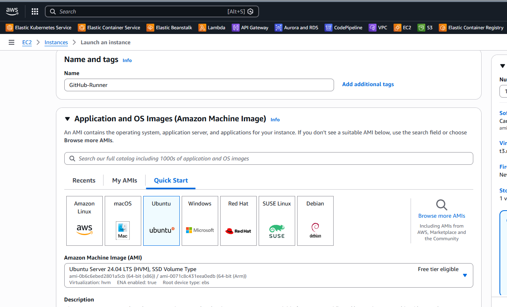
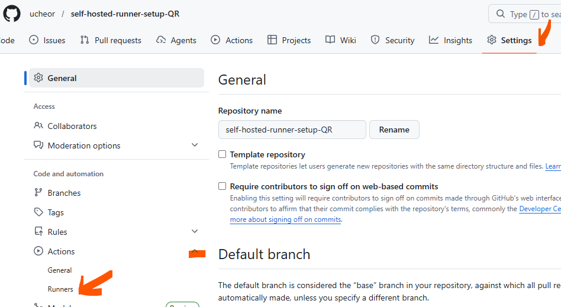
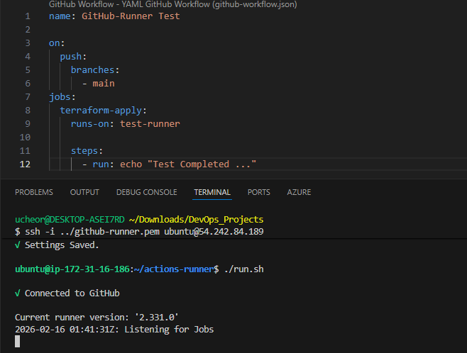
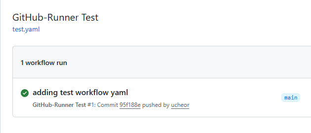
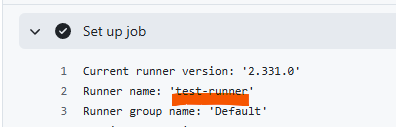

**Setting Up a GitHub Actions Self-Hosted Runner**

Using a self-hosted runner in GitHub Actions gives you full control over your CI/CD environment. You can run jobs on your own servers or cloud VMs, install custom dependencies, access private VPC resources, and meet strict security or compliance requirements. This is ideal for teams that need consistent performance, specialized tooling, or access to internal systems.

Although self-hosted runners can be more expensive than GitHub-hosted runners, they are often better suited for resource-heavy or long-running workflows—such as large builds, high-memory jobs, or GPU workloads—where the added control and performance flexibility outweigh the higher operational cost.

Let's go over steps to set up a GitHub Actions self-hosted runner.

📋 **Prerequisites**
Supported OS: Linux (x64, ARM32, ARM64), macOS (x64, ARM64), or Windows (x64, ARM64).

Permissions: You must have admin access to the repository or organization.

Network: The runner needs outbound HTTPS access to GitHub; no inbound ports need to be opened.



🛠️ **Installation Steps**
1. Generate Runner Credentials
Navigate to your GitHub repository (or organization).

Go to Settings > Actions > Runners.

Click New self-hosted runner.

Select your Operating System and Architecture.

---


---
2. Download & Configure
Follow the commands provided on the GitHub setup page. 

3. Run the Runner
To start the runner manually for testing:

Bash
./run.sh

---

---
🏗️ **Running as a Service (Recommended)**
To ensure the runner starts automatically after a reboot and runs in the background, install it as a system service.

Linux (Systemd):

```
sudo ./svc.sh install
sudo ./svc.sh start
```

Windows:

During the ./config.cmd step, the script will ask if you want to run the runner as a service. Select Y.

---
📝 **Usage in Workflow Files**

To target your new runner, update the runs-on field in your .github/workflows/*.yaml. Switch value from ubuntu-latest (for example) to self-hosted or any other label you assigned to your runner. 

Initiate your workflow as usual based on trigger.

---

---

---

⚠️ **Security Best Practices**

---
**IMPORTANT** - 
Never use self-hosted runners on public repositories. > Forking a public repo allows users to run malicious code on your machine via Pull Requests. Only use self-hosted runners for private repositories.

Updates: The runner software auto-updates, but ensure your OS patches are current.

Labels: Use custom labels (e.g., runs-on: [self-hosted, linux, hiro-dev-runner, ansible-runner]) to route specific jobs to specific hardware.

---
**Troubleshooting**
If you did not set the run process as a service, the process is killed once you close the terminal window. This marks your runner as "Offline" in GitHub. To set up the service, navigate into the actions-runner directory and follow **Running as a Service (Recommended)** step above.
